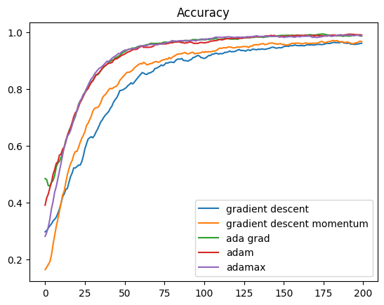

# Deep Learning Optimization Methods

## Goal
- Gain the ability to implement various optimizers
- Understand what the optimization is in terms of deep learning

## Background
### Deep learning architecture
#### [U-Net architecture](#ref-4)
- Known for precise segmentation with smaller size of traning dataset

### [Optimizer](#ref-4)
1. SGD
    - Optimizer with fixed LR/MR
1. AdaGrad
    - Optimizer with adaptive LR
    - `learning rate for sparse features parameters needs to be higher compare to the dense features parameter because the frequency of occurrence of sparse features is lower`
1. ADAM
    - Optimizer with adaptive LR/MR
1. Adamax
    - variant of Adam based on infinity norm

## Success Measure
- Plot comparison graphs for each optimizer with its evaluation metrics

## Results
### Training Accuracy

### Test Accuracy

### Loss

## Timeline
| Date          | Task          |
| ------------- | ------------- |
| Week1 (1/15)  | Look for proper dataset for medical image segmentation |
| Week2 (1/22)  | Implement Deep Learning model for the chosen dataset and learn its syntax |
| Week3 (1/29)  | Continue implementing Deep Learning model for the chosen dataset |
| Week4 (2/5)  | Modularize jupyter notebook / Setup environment for server |
| Week5 (2/12)  | Modularize a monolithic code base |
| Week6 (2/19)  | Implement evaluation methods |
| Week7 (2/26)  | Test model with a larger data in the server & Setup environment for server |
| Week8 (3/4)   | Midterm |
| Week9 (3/11)  | Spring break |
| Week9 (3/18)  | Implement GD optimizer |
| Week10 (3/25)  | Implement SGD optimizer |
| Week11 (4/1)  | Implement SGD with Momentum optimizer |
| Week12 (4/8)  | Implement adaptive optimizers (AdaGrad/ADAM) |
| Week13 (4/15)  | Implement image segmentation model for larger data |
| Week14 (4/22)  | Implement stopping condition / Adamax optimizer |
| Week15 (4/29)  | Review the result |

## How to setup environment
`conda env create -f environment.yml` // Craete environment from environment file

## Reference
### Research Paper
1. <a href="https://bmcresnotes.biomedcentral.com/articles/10.1186/s13104-022-06096-y" id="ref-3">Towards a guideline for evaluation metrics in medical image segmentation</a>
1. <a href="https://www.frontiersin.org/articles/10.3389/fradi.2023.1175473/full" id="ref-4">Selecting the best optimizers for deep learning–based medical image segmentation</a>
1. <a href="https://arxiv.org/pdf/2211.15596.pdf" id="ref-6">A survey of deep learning optimizers - first and second order methods</a>
1. <a href="https://arxiv.org/pdf/cs/0102001.pdf" id="ref-8">Benchmarking Optimization Software with Performance Profiles</a>

### Dataset
- [TensorFlow: MNIST Dataset](https://www.tensorflow.org/datasets/catalog/mnist)

### Code
#### Image Segmentation
- [Dataloader for semantic segmentation](https://discuss.pytorch.org/t/dataloader-for-semantic-segmentation/48290)
#### Optimization
- [Github: Custom optimizers](https://github.com/toru34/tf_optimizers)
- [PyTorch: OPTIMIZING MODEL PARAMETERS](https://pytorch.org/tutorials/beginner/basics/optimization_tutorial.html)
- [PyTorch: TORCH.OPTIM](https://pytorch.org/docs/stable/optim.html)
- [TensorFlow: Custom optimizers](https://www.tensorflow.org/guide/core/optimizers_core)
#### Environment
- [Apple: tensorflow](https://developer.apple.com/metal/tensorflow-plugin/)
- [Conda: Managing environments](https://conda.io/projects/conda/en/latest/user-guide/tasks/manage-environments.html#creating-an-environment-with-commands)